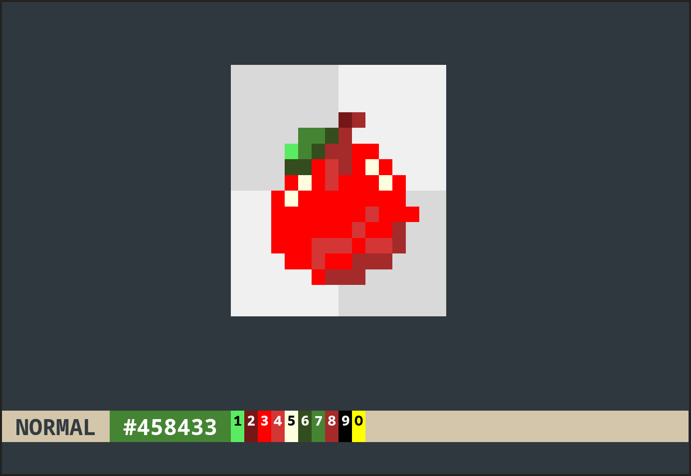

# tuisprite

Create sprites images in your terminal.

> [!NOTE]
> Still a work in progress.

## Usage

- cli
  - `tuisprite` open an empty drawing
  - `tuisprite <path.json>` open drawing at path
- command mode `:<command>`
  - `:w` save
  - `:w <path>` save to path
  - `:q` quit
  - `:color` get color
  - `:color red` set color
- script mode `:=<script>` run JavaScript code
  - `:= color = "red"` set color to red
- key bindings
  - `-` decrease size
  - `+/=` increase size
  - `E` erase all

## How this works

- The pixel cell is emulated with upper (`▀`) and lower (`▄`) [Unicode Block Element](https://en.wikipedia.org/wiki/Block_Elements) and ANSI escape code colors.
- Terminal has to support SGR Pixel Mouse Report.
  - TODO: SGR Cell mode compatbility (left and right)